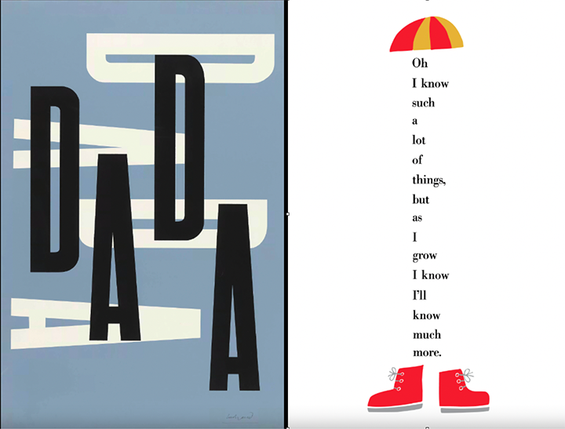
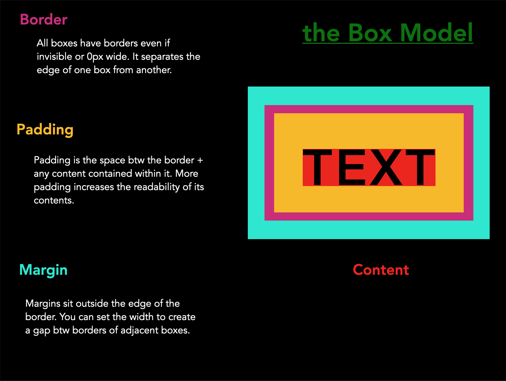

##### Wednesday October 1st in class exercise
Using the starter code provided, either on your own or in pairs try your best to recreate the Paul Rand designs. Make sure to reference the positioning documentatino below.

##### Pre-responsive CSS positioning
* [MDN on positioning](https://developer.mozilla.org/en-US/docs/Learn_web_development/Core/CSS_layout/Positioning)
* [CSS Tricks on Positioning](https://css-tricks.com/absolute-relative-fixed-positioining-how-do-they-differ/)

***

#### [the Box Model](https://developer.mozilla.org/en-US/docs/Web/CSS/CSS_Box_Model/Introduction_to_the_CSS_box_model)
* [MDN on padding](https://developer.mozilla.org/en-US/docs/Web/CSS/padding)
* [MDN on border](https://developer.mozilla.org/en-US/docs/Web/CSS/border) 
* [MDN on margin](https://developer.mozilla.org/en-US/docs/Web/CSS/margin)

***

##### Flexbox Display
* [MDN Flexbox](https://developer.mozilla.org/en-US/docs/Learn/CSS/CSS_layout/Flexbox)
* [CSS-Trick on Flexbox](https://css-tricks.com/snippets/css/a-guide-to-flexbox/)
* [Flexbox Game](https://flexbox.webflow.com/)

 ##### Grid Display
 * [MDN Grid Layout](https://developer.mozilla.org/en-US/docs/Web/CSS/CSS_Grid_Layout/Relationship_of_Grid_Layout)
 * [CSS-Tricks on Grids](https://css-tricks.com/snippets/css/complete-guide-grid/)
 * [CSS-Tricks on Grid starter layouts](https://css-tricks.com/snippets/css/css-grid-starter-layouts/)

 ##### Responsive Web Design:
* [Responsive Meta Tag](https://css-tricks.com/snippets/html/responsive-meta-tag/)
* [Viewport Meta Tag](https://developer.mozilla.org/en-US/docs/Mozilla/Mobile/Viewport_meta_tag)
* [MDN Media Queries](https://developer.mozilla.org/en-US/docs/Web/CSS/Media_Queries/Using_media_queries)
* [Media Queries for Standard Devices](https://css-tricks.com/snippets/css/media-queries-for-standard-devices/)
* [Mobile First](https://responsivedesign.is/strategy/page-layout/mobile-first/)
* [Responsive Images](https://developer.mozilla.org/en-US/docs/Learn/HTML/Multimedia_and_embedding/Responsive_images)

##### CSS Resources
* [MDN CSS Property Index](https://developer.mozilla.org/en-US/docs/Web/CSS/Reference)
* [MDN positioning](https://developer.mozilla.org/en-US/docs/Web/CSS/position)
* [MDN layout](https://developer.mozilla.org/en-US/docs/Web/CSS/Reference#layout)
* [cssreference.io - CC Property Reference](https://cssreference.io/) - Free visual guide 
* [Display Property](https://developer.mozilla.org/en-US/docs/Web/CSS/display)

  ##### CSS Units of Measurement
* [w3 Schools CSS units](https://www.w3schools.com/cssref/css_units.asp)
* [MDN CSS units, lengths](https://developer.mozilla.org/en-US/docs/Learn/CSS/Building_blocks/Values_and_units)
* [A Pixel is not a Pixel](https://www.quirksmode.org/blog/archives/2010/04/a_pixel_is_not.html)

##### CSS Animations!
* [MDN Animatable CSS properites](https://developer.mozilla.org/en-US/docs/Web/CSS/CSS_animated_properties)